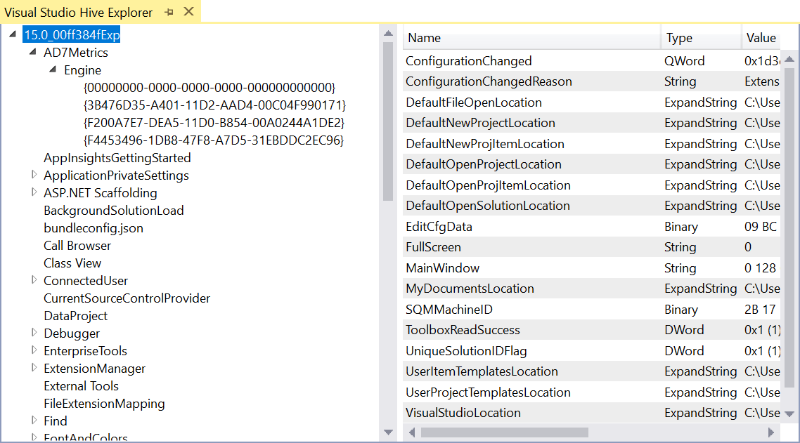

# Registry Explorer

**Requires Visual Studio 2017.6 and newer**

This extension provides a tool window for looking at the Visual Studio registry hive.

Open the tool window from the top menu **View -> Other Windows -> Visual Studio Hive Explorer**.

## Contribute
Check out the [contribution guidelines](.github/CONTRIBUTING.md)
if you want to contribute to this project.

For cloning and building this project yourself, make sure
to install the
[Extensibility Tools](https://visualstudiogallery.msdn.microsoft.com/ab39a092-1343-46e2-b0f1-6a3f91155aa6)
extension for Visual Studio which enables some features
used by this project.

## License
[Apache 2.0](LICENSE)